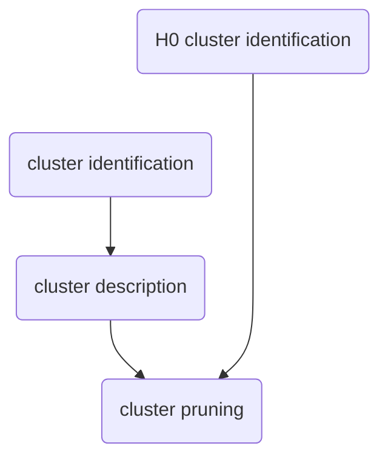

**PhysioExplorer** is a set of functions for _identifying_, _describing_, and _pruning_ the results of cluster-based analysis.
Clusters can be defined in a 3-dimensional space (e.g, spatial-temporal-spectral) or a lower-dimensional space (e.g., spatial-temporal, temporal-spectral).  

## High-level description
### Cluster-level statistics
At the heart of the code is a _cluster forming_ algorithm that combines adjacency criteria (e.g., spatial-temporal-spectral) with the results of univariate statistical testing (e.g., p-values). The code forms clusters on the observed data and also on many sets of surrogate data artificially created under the _null hypothesis_ of exchangeability of group/condition labels. The surrogate data are sampled through the Monte-Carlo approach. In each Monte-Carlo iteration, group/condition labels are shuffled with participants sampled with replacement (bootstrap) or not (permutation), and the statistics are recomputed. The code compares the observed cluster metrics (cluster size or mass) with the null-hypothesis distribution to evaluate their statistical significance. Inference is therefore done at the cluster level and not at the point level. If the distribution only includes the most extreme cluster per Monte-Carlo iteration, this statistical procedure controls for Family-Wise Error Rate (FWER).

## Usage

## Wish list (future updates)
- cluster-level statistics
  - mediation
  - 4d space (time x 3d MNI space)
  - alternative cluster forming not based on statistical significance
- multivariate analyses

## Cite as
...DOI to arrive...
