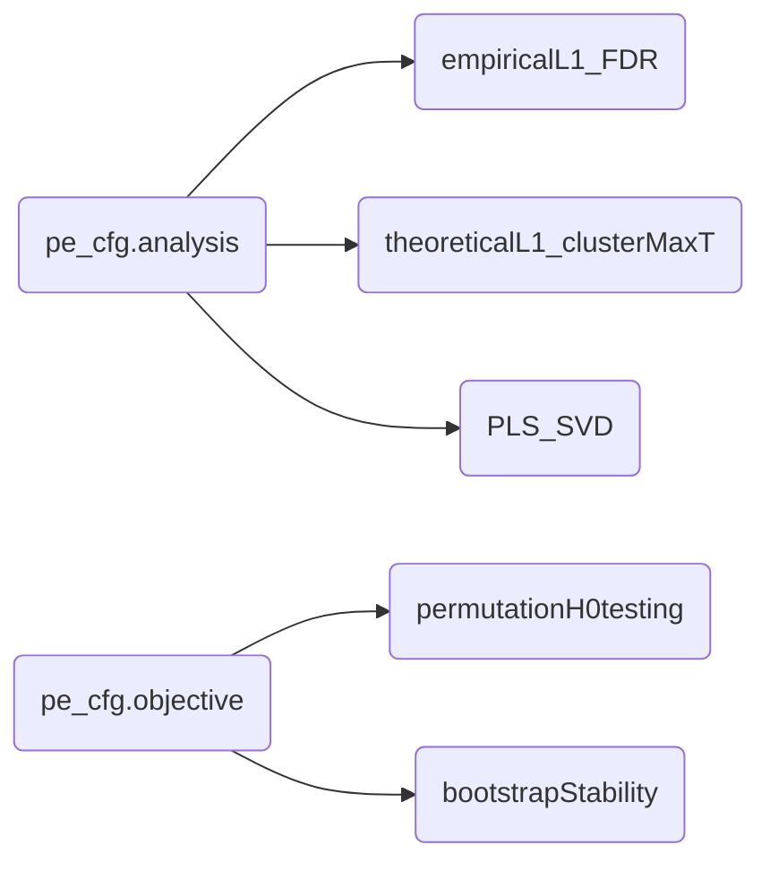

**PhysioExplorer (PE)** is a set of functions to extract patterns from multivariate physiological data. When the number of variables is much larger than the number of observations and when the variables are highly correlated, the data present unique challenges and are sometimes called "megavariate" (see Eriksson et al., 2013). PhysioExplorer can perform any combination of _analysis_ and _objective_ described below in both multivariate and megavariate contexts (with no distinction). One solution to the high collinearity is to run mass (i.e., a lot of) univariate tests and then cluster their results where there is contiguity in some physical dimension (e.g., time, frequency, sensor space). Another solution is to find the combination of the whole set of features that best describes behavioral data or experimental design group/condition.

Code developed on MATLAB R2022b on a Windows 10 device.

## pe_cfg.analysis (Analysis)
### 'empiricalL1_FDR'
...upcoming...

### 'theoreticalL1_clusterMaxT'
**Cluster-level analysis** (Groppe et al., 2011; Maris & Oostenveld, 2007) is a two-step procedure: (1) compute univariate test statistics, evaluate them against the associated theoretical distribution to get p-values, and threshold them, (2) form spatial/temporal/spectral clusters of suprathreshold points. Clusters can be defined in a 3-dimensional space (e.g, time-frequency-channel, frequency-frequency-channel) or a lower-dimensional subset (e.g., time-channel, time-frequency, frequency-channel, time). At the heart of the code is a_cluster forming algorithm that combines adjacency criteria (e.g., spatial-temporal-spectral) with the results of univariate statistical testing (e.g., p-values). The code forms clusters on the observed data and, depending on the _objective_ many sets of surrogate data artificially created under the null hypothesis of exchangeability of group/condition labels (permutataion) or many replicates, each with sampling variability, of the original data (bootstrap). The surrogate data are sampled through the Monte-Carlo approach. 

### 'PLD_SVD'
**SVD-based Partial Least Squares** is a form of symmetric covariance mapping (Note: SVD stands for singular value decomposition.) It handles multi/megavariate data structures natively (in one step) to find combinations of features that best describe the linear associations between two sets of variables. The number of combinations found depends on how much linear independence is in the combined data (the rank). Each combination is characterized by the singular value, informing on how much this combination explains of the covariance, and two singular vectors (one for each variable set), telling how the original variables should be weighted to form that specific combination. Resampling statistics are then used to evaluate whether a certain mapping has a magnitude larger than noise (permutation testing on the singular value based metrics) or whether a certain combination's weights are stable under sampling variability (bootstrap evaluation on the weights).

## pe_cfg.objective (Objective)
### 'permutation'
**Permutation** is for null-hypothesis testing. In each Monte-Carlo iteration, group/condition labels are shuffled, and the statistics are recomputed. The code compares the observed cluster metrics (e.g., cluster mass, singular value) with the distribution of the same metrics under the null hypothesis to evaluate their statistical significance. (Note: for cluster analysis, inference is done at the cluster level and not at the point level.)
### 'bootstrap'
**Bootstrap** is for stability estimation.

### What PE's current version can do
[X] = PE can do it
 
[ ] = PE cannot yet do it
 
| analysis & objective | symmetric association between variables | compare groups | compare levels of one repeated-measure factor
| ---: | :---: | :---: | :---: | 
| empiricalL1_FDR permutation             | [X] (2 variables)     | [X] (2 groups)   | [X] (2 levels) |
| empiricalL1_FDR bootstrap               | [X] (2 variables)     | [X] (2 groups)   | [X] (2 levels) |
| theoreticalL1_clusterMaxT permutation   | [X] (2 variables)     | [X] (2 groups)   | [X] (2 levels) |
| theoreticalL1_clusterMaxT bootstrap     | [ ] (2 variables)     | [ ] (2 groups)   | [ ] (2 levels) |
| PLS_SVD permutation                     | [ ] (2 variable sets) | [ ] (2+ groups)  | [ ] (2+ levels) |
| PLS_SVD bootstrap                       | [ ] (2 variable sets) | [ ] (2+ groups)  | [ ] (2+ levels) |

### Wish list (maybe future updates)
The wish list is mainly driven by a combination of (1) my needs, (2) my interests, and (3) helping my future self replicate analyses
- cluster descriptives: effect size for group/condition comparison 
- visualize results: pe_view
- own version of topoplot to reduce dependency on eeglab
- write tutorials on how to use PhysioExplorer

## Cite as
Gallicchio, G. (2025). PhysioExplorer. Zenodo. https://doi.org/10.5281/zenodo.16808782
 
 

# References
Eriksson, L., Byrne, T., Johansson, E., Trygg, J., & Vikström, C. (2013). Multi-and megavariate data analysis basic principles and applications. Umetrics Academy.

Groppe, D. M., Urbach, T. P., & Kutas, M. (2011). Mass univariate analysis of event‐related brain potentials/fields I: A critical tutorial review. Psychophysiology, 48(12), 1711-1725.

Maris, E., & Oostenveld, R. (2007). Nonparametric statistical testing of EEG-and MEG-data. Journal of neuroscience methods, 164(1), 177-190.
