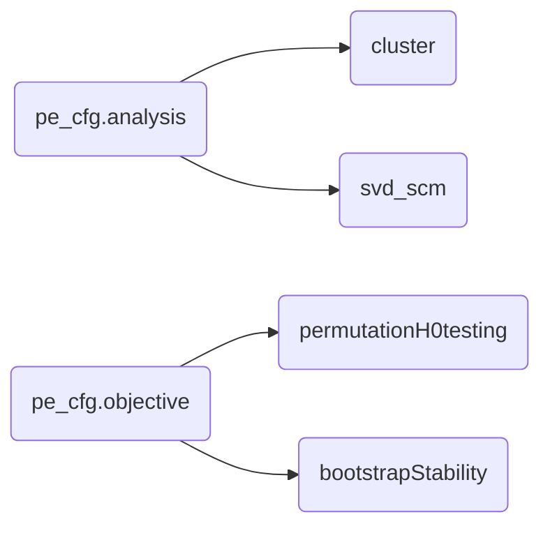

**PhysioExplorer** is a set of functions to extract patterns from multivariate and megavariate data. Both multivariate and megavariate analyses aim to identify patterns among many variables. In multivariate analysis, the number of variables is smaller than the number of observations, and the variables are not correlated. In megavariate analysis, the number of variables is larger (often much larger) than the number of observations, and the variables are highly correlated (there is collinearity). See Eriksson et al. (2013) for more information. PhysioExplorer can perform any combination of _analysis_ and _objective_ described below. 

## pe_cfg.analysis (Analysis)
### 'cluster'
**Cluster-level analysis** (Groppe et al., 2011; Maris & Oostenveld, 2007) is a two-step procedure: a large amount of univariate analyses followed by cluster forming in the multi/megavariate space. Clusters can be defined in a 3-dimensional space (e.g, time-frequency-channel, frequency-frequency-channel) or a lower-dimensional subset (e.g., time-channel, time-frequency, frequency-channel, time). At the heart of the code is a_cluster forming algorithm that combines adjacency criteria (e.g., spatial-temporal-spectral) with the results of univariate statistical testing (e.g., p-values). The code forms clusters on the observed data and, depending on the _objective_ many sets of surrogate data artificially created under the null hypothesis of exchangeability of group/condition labels (permutataion) or many replicates, each with sampling variability, of the original data (bootstrap). The surrogate data are sampled through the Monte-Carlo approach. 

### 'svd_scm'
**SVD-based Symmetric Covariance Mapping** handles multi/megavariate data structures natively (in one step) to find associations between two sets of variables. SVD stands for singular value decomposition. (Note: I think the term SVD-SCM is more representative of the underlying maths, but (a) nobody apart from me uses it and (b) it does not give justice to its history. More historically-aware and better-known terms are PLS-C (i.e., Partial Least Squares - Correlation; _REFERENCE_)

## pe_cfg.objective (Objective)
### 'permutation'

**Permutation** is for null-hypothesis testing. In each Monte-Carlo iteration, group/condition labels are shuffled with participants sampled with replacement (bootstrap) or not (permutation), and the statistics are recomputed. The code compares the observed cluster metrics (e.g., cluster mass, singular value) with the null-hypothesis distribution to evaluate their statistical significance. (Note: for cluster analysis, inference is done at the cluster level and not at the point level.)
### 'bootstrap'.

**Bootstrap** is for stability estimation.

### Wish list (future updates)
- mediation
- 4d space (time x 3d MNI space)
- alternative cluster forming not based on statistical significance
- write tutorials on how to use PhysioExplorer

## Cite as
...DOI to arrive...
https://github.com/GermanoGallicchio/PhysioExplorer

# References
Eriksson, L., Byrne, T., Johansson, E., Trygg, J., & Vikström, C. (2013). Multi-and megavariate data analysis basic principles and applications. Umetrics Academy.

Groppe, D. M., Urbach, T. P., & Kutas, M. (2011). Mass univariate analysis of event‐related brain potentials/fields I: A critical tutorial review. Psychophysiology, 48(12), 1711-1725.

Maris, E., & Oostenveld, R. (2007). Nonparametric statistical testing of EEG-and MEG-data. Journal of neuroscience methods, 164(1), 177-190.
