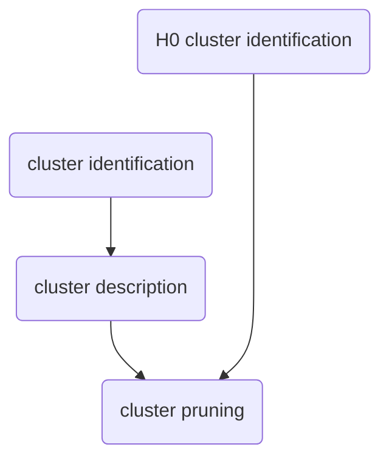

A set of functions for _identifying_, _describing_, and _pruning_ the results of cluster-based analysis.
Clusters can be defined across 1-3 dimensions (e.g, time, time-EEGsensors, time-frequency-EEGsensors). 

## Null hypothesis (H0) clusters
Clusters under the null hypothesis need to be computed outside of these functions, but code is provided below for Monte-Carlo random permutations.

## Usage

