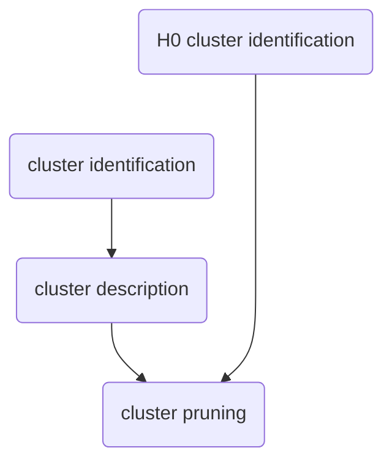

A set of functions for _identifying_, _describing_, and _pruning_ the results of cluster-based analysis performed with the Monte Carlo random permutation approach.

## Usage

```mermaid
  graph TD;
    D(H0 cluster identification)
    A(cluster identification)
    B(cluster description)
    C(cluster pruning)
    A-->B-->C;
    D---->C
    
```
